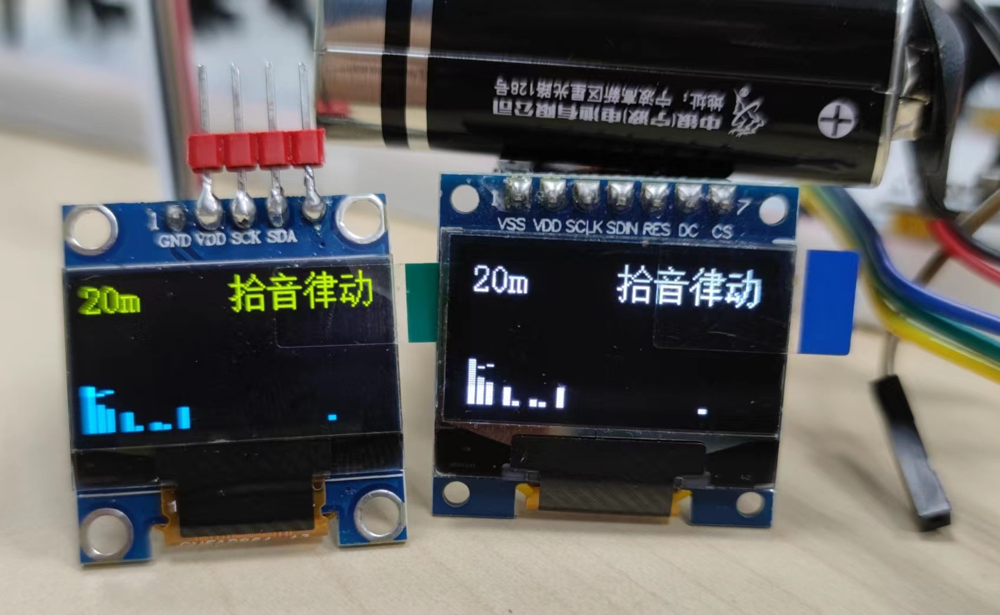

# dual_oled
It is a dual oled code for stm32f103c8 with mic and fft feature.

此活动，早些年就开始了。中间停停做做。直到现在才比较满意。

2022-07-30

---

## 用到了以下的材料（如图所示）：
* stm32f103c8 开发板

* oled和lcd屏 
    &emsp;oled : 128x64 (iic或spi接口） 
	&emsp;lcd : 128x96 (1.3  oled(color) - SSD1351 - spi接口) 
	&emsp;&emsp;&nbsp;&nbsp;: 128x80 (0.96 oled(color) - ST7735 - spi接口) 

* mic模块 : MAX9812

* 按键

* 等

### 图片位置 dfiles/components.jpg

---

## 以上材料的连接，请查看dfiles目录里的stm32f103c8-io-ref.pdf

杂乱的连接示意图

### 图片位置 dfiles/connection.jpg

---

## 基本实现方式：
通过ADC采样输入的声音信号，然后经过FFT转换，再转dB，然后在oled和LCD屏上显示。
按键可以切换不同的显示方式。

---

## 使用MDK5编译，需要安装Keil.STM32F1xx_DFP.2.3.0.pack芯片支持包

---

## 演示图片

### 图片位置 dfiles/showpic.png

128x64的oled
### 双oled图片位置 dfiles/dual_oled.jpg

